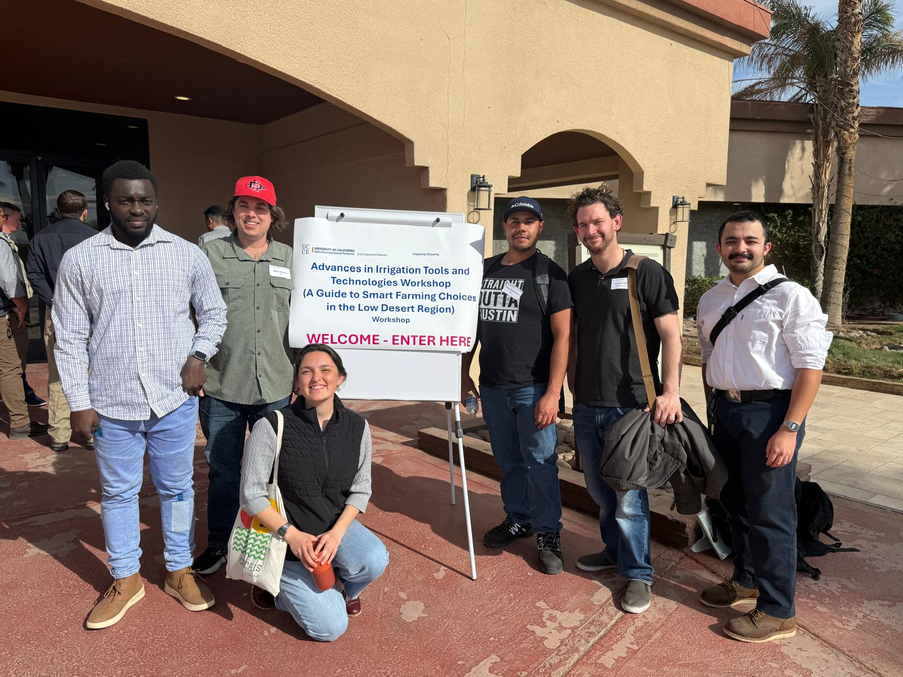

## First Name : Kwasi
## Last Name : Asomani

[BDA/GEOG594 class](https://sdsu.instructure.com/courses/186022)

**Big Data** :refers to information that is voluminous and diverse, requiring advanced technologies and methods to analyze in order to gain meaningful insights and support decision-making.

